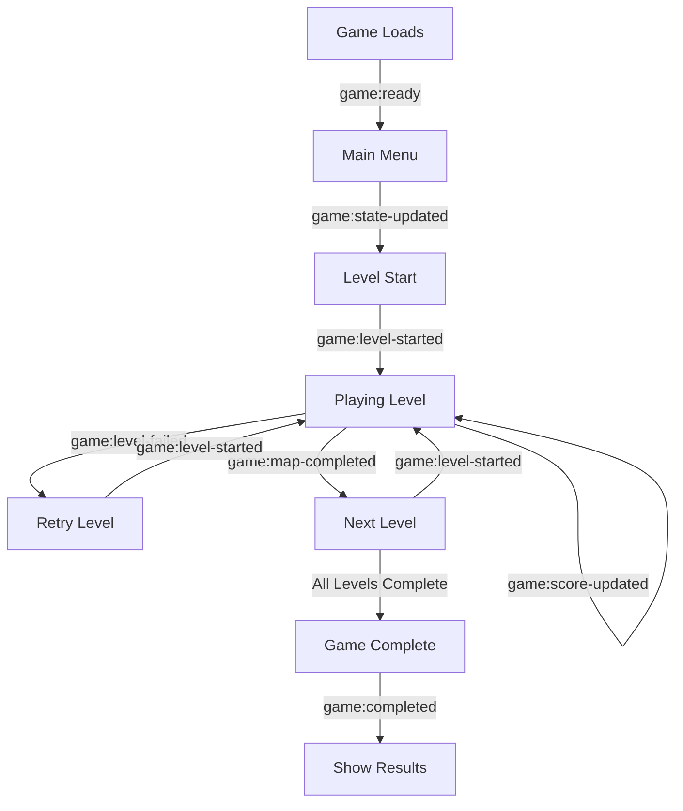

# Game Communication API Documentation

## Overview

The Sigurd Startup Game communicates with its host application through a series of CustomEvents dispatched to the window object. This document provides a comprehensive guide on the data structures, events, and integration patterns for external sites hosting the game.

## Table of Contents

1. [Architecture](#architecture)
2. [Data Structures](#data-structures)
3. [Event Types](#event-types)
4. [Integration Guide](#integration-guide)
5. [Event Flow](#event-flow)
6. [Code Examples](#code-examples)
7. [Best Practices](#best-practices)

---

## Architecture

The game uses browser CustomEvents to communicate with its host application. All events:
- Are dispatched on the `window` object
- Have `bubbles: true` and `composed: true` properties
- Include a `detail` property containing the event data
- Include a `timestamp` field for tracking

### Communication Flow
```
Game Instance → CustomEvent → Window → Host Application Event Listener
```

---

## Data Structures

### LevelStartData
Sent when a player starts a new level.

```typescript
interface LevelStartData {
  level: number;        // Current level number (1-based)
  mapName: string;      // Name of the map being played
  timestamp: number;    // Unix timestamp in milliseconds
}
```

### LevelFailureData
Sent when a player fails to complete a level.

```typescript
interface LevelFailureData {
  level: number;            // Level that was failed
  mapName: string;          // Map where failure occurred
  score: number;            // Score at time of failure
  bombs?: number;           // Number of bombs hit (optional)
  correctOrders?: number;   // Number of correct orders completed (optional)
  lives: number;            // Remaining lives
  multiplier: number;       // Current score multiplier
  timestamp?: number;       // Unix timestamp (auto-generated if not provided)
}
```

### MapCompletionData
Sent when a player successfully completes a map/level.

```typescript
interface MapCompletionData {
  mapName: string;              // Name of completed map
  level: number;                // Level number
  correctOrderCount: number;    // Number of correct orders collected
  totalBombs: number;           // Total bombs encountered
  score: number;                // Current score
  bonus: number;                // Bonus points earned
  hasBonus: boolean;            // Whether bonus was awarded
  timestamp: number;            // Unix timestamp
  lives: number;                // Remaining lives
  multiplier: number;           // Current score multiplier
  completionTime?: number;      // Time to complete (milliseconds)
  coinsCollected?: number;      // Number of coins collected
  powerModeActivations?: number; // Times power mode was activated
}
```

### LevelHistoryEntry
Used to track individual level performance in the game session.

```typescript
interface LevelHistoryEntry {
  level: number;                // Level number
  mapName: string;              // Map name
  score: number;                // Score achieved
  bonus: number;                // Bonus points
  completionTime?: number;      // Time to complete (optional)
  coinsCollected: number;       // Coins collected
  powerModeActivations: number; // Power mode uses
  timestamp: number;            // When level was played
  correctOrderCount: number;    // Correct orders
  totalBombs: number;           // Total bombs
  lives: number;                // Lives remaining
  multiplier: number;           // Score multiplier
  isPartial?: boolean;          // True if level wasn't completed
}
```

### GameCompletionData
Comprehensive data sent when the entire game session ends.

```typescript
interface GameCompletionData {
  finalScore: number;               // Final game score
  totalLevels: number;              // Total levels in game
  completedLevels: number;          // Levels successfully completed
  timestamp: number;                // End time timestamp
  lives: number;                    // Final lives count
  multiplier: number;               // Final multiplier
  levelHistory: LevelHistoryEntry[]; // Array of all level attempts
  totalCoinsCollected: number;     // Total coins across all levels
  totalPowerModeActivations: number; // Total power mode uses
  totalBombs: number;               // Total bombs encountered
  totalCorrectOrders: number;       // Total correct orders
  averageCompletionTime: number;    // Average time per level (seconds)
  gameEndReason: "completed" | "failed"; // How game ended
  sessionId: string;                // Unique session identifier
  startTime: number;                // Game start timestamp
  endTime: number;                  // Game end timestamp
  userDisplayName?: string;         // Optional user display name
  userEmail?: string;               // Optional user email
  userId?: string;                  // Optional user ID
}
```

---

## Event Types

### 1. `scoreUpdate`
**Purpose:** Real-time score updates  
**Frequency:** High (triggered on every score change)

```javascript
window.addEventListener('scoreUpdate', (event) => {
  const { score } = event.detail;
  // Update score display
});
```

### 2. `game:score-updated`
**Purpose:** Detailed score update with context  
**Frequency:** High (triggered alongside scoreUpdate)

```javascript
window.addEventListener('game:score-updated', (event) => {
  const { score, map, timestamp, level, lives, multiplier } = event.detail;
  // Process detailed score data
});
```

### 3. `game:ready`
**Purpose:** Signals that the game has fully loaded and is ready  
**Frequency:** Once per game load

```javascript
window.addEventListener('game:ready', (event) => {
  const { timestamp } = event.detail;
  // Game is ready to receive commands
});
```

### 4. `game:level-started`
**Purpose:** Notifies when a new level begins  
**Frequency:** Once per level start

```javascript
window.addEventListener('game:level-started', (event) => {
  const { level, mapName, timestamp } = event.detail;
  // Track level progression
});
```

### 5. `game:level-failed`
**Purpose:** Notifies when a level is failed  
**Frequency:** On level failure

```javascript
window.addEventListener('game:level-failed', (event) => {
  const failureData = event.detail;
  // Handle level failure
});
```

### 6. `game:state-updated`
**Purpose:** General game state changes  
**Frequency:** On major state transitions

```javascript
window.addEventListener('game:state-updated', (event) => {
  const { state, map, timestamp } = event.detail;
  // Track game state changes
});
```

### 7. `game:map-completed`
**Purpose:** Detailed data when a map is completed  
**Frequency:** Once per successful map completion

```javascript
window.addEventListener('game:map-completed', (event) => {
  const completionData = event.detail;
  // Process map completion
});
```

### 8. `game:completed`
**Purpose:** Comprehensive data when game session ends  
**Frequency:** Once per game session

```javascript
window.addEventListener('game:completed', (event) => {
  const gameData = event.detail;
  // Process final game results
});
```

---

## Integration Guide

### Basic Setup

```javascript
class GameIntegration {
  constructor() {
    this.sessionData = {
      startTime: null,
      currentLevel: 0,
      currentScore: 0,
      levelHistory: []
    };
    
    this.setupEventListeners();
  }
  
  setupEventListeners() {
    // Game ready
    window.addEventListener('game:ready', this.handleGameReady.bind(this));
    
    // Score tracking
    window.addEventListener('scoreUpdate', this.handleScoreUpdate.bind(this));
    window.addEventListener('game:score-updated', this.handleDetailedScore.bind(this));
    
    // Level tracking
    window.addEventListener('game:level-started', this.handleLevelStart.bind(this));
    window.addEventListener('game:level-failed', this.handleLevelFailed.bind(this));
    window.addEventListener('game:map-completed', this.handleMapCompleted.bind(this));
    
    // Game completion
    window.addEventListener('game:completed', this.handleGameCompleted.bind(this));
    
    // State changes
    window.addEventListener('game:state-updated', this.handleStateUpdate.bind(this));
  }
  
  handleGameReady(event) {
    console.log('Game is ready at:', new Date(event.detail.timestamp));
    this.sessionData.startTime = event.detail.timestamp;
    // Enable game controls, show UI, etc.
  }
  
  handleScoreUpdate(event) {
    this.sessionData.currentScore = event.detail.score;
    // Update score display
    this.updateScoreDisplay(event.detail.score);
  }
  
  handleDetailedScore(event) {
    const { score, map, level, lives, multiplier } = event.detail;
    // Process detailed score information
    this.updateGameStats({
      score,
      map,
      level,
      lives,
      multiplier
    });
  }
  
  handleLevelStart(event) {
    const { level, mapName, timestamp } = event.detail;
    this.sessionData.currentLevel = level;
    
    // Track level start
    this.trackEvent('level_start', {
      level,
      mapName,
      timestamp
    });
  }
  
  handleLevelFailed(event) {
    const failureData = event.detail;
    
    // Log failure for analytics
    this.trackEvent('level_failed', failureData);
    
    // Show retry UI or encouragement
    this.showRetryPrompt(failureData);
  }
  
  handleMapCompleted(event) {
    const completionData = event.detail;
    
    // Store level history
    this.sessionData.levelHistory.push({
      level: completionData.level,
      mapName: completionData.mapName,
      score: completionData.score,
      bonus: completionData.bonus,
      timestamp: completionData.timestamp
    });
    
    // Track success
    this.trackEvent('map_completed', completionData);
    
    // Show success UI
    this.showSuccessMessage(completionData);
  }
  
  handleGameCompleted(event) {
    const gameData = event.detail;
    
    // Process final results
    this.processGameResults(gameData);
    
    // Send to backend
    this.saveGameSession(gameData);
    
    // Show results screen
    this.showGameResults(gameData);
  }
  
  handleStateUpdate(event) {
    const { state, map } = event.detail;
    
    // Update UI based on state
    switch(state) {
      case 'playing':
        this.showGameUI();
        break;
      case 'paused':
        this.showPausedOverlay();
        break;
      case 'menu':
        this.showMenuOverlay();
        break;
      case 'game-over':
        this.showGameOverScreen();
        break;
    }
  }
  
  // Helper methods
  updateScoreDisplay(score) {
    const scoreElement = document.getElementById('game-score');
    if (scoreElement) {
      scoreElement.textContent = score.toLocaleString();
    }
  }
  
  updateGameStats(stats) {
    // Update UI with game statistics
    console.log('Game stats updated:', stats);
  }
  
  trackEvent(eventName, data) {
    // Send to analytics service
    if (window.analytics) {
      window.analytics.track(eventName, data);
    }
  }
  
  showRetryPrompt(failureData) {
    // Show retry UI
    console.log(`Level ${failureData.level} failed. Score: ${failureData.score}`);
  }
  
  showSuccessMessage(completionData) {
    // Show success notification
    console.log(`Map ${completionData.mapName} completed! Bonus: ${completionData.bonus}`);
  }
  
  processGameResults(gameData) {
    // Calculate additional metrics
    const accuracy = (gameData.totalCorrectOrders / gameData.totalBombs * 100).toFixed(1);
    const scorePerLevel = Math.round(gameData.finalScore / gameData.completedLevels);
    
    return {
      accuracy,
      scorePerLevel,
      ...gameData
    };
  }
  
  async saveGameSession(gameData) {
    // Save to backend
    try {
      const response = await fetch('/api/game-sessions', {
        method: 'POST',
        headers: {
          'Content-Type': 'application/json'
        },
        body: JSON.stringify(gameData)
      });
      
      if (response.ok) {
        console.log('Game session saved successfully');
      }
    } catch (error) {
      console.error('Failed to save game session:', error);
    }
  }
  
  showGameResults(gameData) {
    // Display final results
    const resultsHTML = `
      <div class="game-results">
        <h2>Game ${gameData.gameEndReason === 'completed' ? 'Complete!' : 'Over'}</h2>
        <p>Final Score: ${gameData.finalScore.toLocaleString()}</p>
        <p>Levels Completed: ${gameData.completedLevels}/${gameData.totalLevels}</p>
        <p>Total Coins: ${gameData.totalCoinsCollected}</p>
        <p>Accuracy: ${((gameData.totalCorrectOrders / gameData.totalBombs) * 100).toFixed(1)}%</p>
      </div>
    `;
    
    // Update DOM
    document.getElementById('results-container').innerHTML = resultsHTML;
  }
}

// Initialize integration
const gameIntegration = new GameIntegration();
```

---

## Event Flow

### Typical Game Session Flow



### Event Timeline Example

```
1. game:ready                    // Game initialized
2. game:state-updated (menu)     // Menu displayed
3. game:state-updated (playing)  // Game started
4. game:level-started            // Level 1 begins
5. scoreUpdate (multiple)        // Score changes
6. game:score-updated (multiple) // Detailed score updates
7. game:map-completed            // Level 1 complete
8. game:level-started            // Level 2 begins
9. scoreUpdate (multiple)        // More score changes
10. game:level-failed            // Player fails level
11. game:level-started           // Retry level 2
12. game:map-completed           // Level 2 complete
... (continues for all levels)
N. game:completed                // Game session ends
```

---

## Code Examples

### React Integration

```jsx
import React, { useEffect, useState } from 'react';

const GameContainer = () => {
  const [gameState, setGameState] = useState({
    isReady: false,
    currentScore: 0,
    currentLevel: 0,
    lives: 0,
    multiplier: 1
  });
  
  const [gameResults, setGameResults] = useState(null);
  
  useEffect(() => {
    const handleGameReady = (event) => {
      setGameState(prev => ({ ...prev, isReady: true }));
    };
    
    const handleScoreUpdate = (event) => {
      setGameState(prev => ({ ...prev, currentScore: event.detail.score }));
    };
    
    const handleDetailedScore = (event) => {
      const { score, level, lives, multiplier } = event.detail;
      setGameState(prev => ({
        ...prev,
        currentScore: score,
        currentLevel: level,
        lives: lives,
        multiplier: multiplier
      }));
    };
    
    const handleGameCompleted = (event) => {
      setGameResults(event.detail);
      // Send to API
      saveGameResults(event.detail);
    };
    
    // Add event listeners
    window.addEventListener('game:ready', handleGameReady);
    window.addEventListener('scoreUpdate', handleScoreUpdate);
    window.addEventListener('game:score-updated', handleDetailedScore);
    window.addEventListener('game:completed', handleGameCompleted);
    
    // Cleanup
    return () => {
      window.removeEventListener('game:ready', handleGameReady);
      window.removeEventListener('scoreUpdate', handleScoreUpdate);
      window.removeEventListener('game:score-updated', handleDetailedScore);
      window.removeEventListener('game:completed', handleGameCompleted);
    };
  }, []);
  
  const saveGameResults = async (results) => {
    try {
      await fetch('/api/save-game', {
        method: 'POST',
        headers: { 'Content-Type': 'application/json' },
        body: JSON.stringify(results)
      });
    } catch (error) {
      console.error('Failed to save game results:', error);
    }
  };
  
  if (gameResults) {
    return (
      <div className="game-results">
        <h2>Game Complete!</h2>
        <p>Final Score: {gameResults.finalScore}</p>
        <p>Levels Completed: {gameResults.completedLevels}/{gameResults.totalLevels}</p>
        {/* Display more results */}
      </div>
    );
  }
  
  return (
    <div className="game-container">
      {gameState.isReady ? (
        <>
          <div className="game-stats">
            <span>Score: {gameState.currentScore}</span>
            <span>Level: {gameState.currentLevel}</span>
            <span>Lives: {gameState.lives}</span>
            <span>Multiplier: {gameState.multiplier}x</span>
          </div>
          <iframe 
            src="/game" 
            className="game-iframe"
            title="Sigurd Startup Game"
          />
        </>
      ) : (
        <div>Loading game...</div>
      )}
    </div>
  );
};

export default GameContainer;
```

### Vue.js Integration

```vue
<template>
  <div class="game-wrapper">
    <div v-if="gameReady" class="game-stats">
      <p>Score: {{ currentScore }}</p>
      <p>Level: {{ currentLevel }}</p>
      <p>Lives: {{ lives }}</p>
    </div>
    <iframe 
      ref="gameFrame"
      src="/game"
      @load="setupEventListeners"
    />
    <GameResults 
      v-if="gameCompleted"
      :results="gameResults"
    />
  </div>
</template>

<script>
export default {
  data() {
    return {
      gameReady: false,
      currentScore: 0,
      currentLevel: 0,
      lives: 0,
      gameCompleted: false,
      gameResults: null
    };
  },
  
  methods: {
    setupEventListeners() {
      window.addEventListener('game:ready', this.onGameReady);
      window.addEventListener('game:score-updated', this.onScoreUpdate);
      window.addEventListener('game:level-started', this.onLevelStart);
      window.addEventListener('game:completed', this.onGameCompleted);
    },
    
    onGameReady(event) {
      this.gameReady = true;
      console.log('Game ready at:', new Date(event.detail.timestamp));
    },
    
    onScoreUpdate(event) {
      const { score, level, lives } = event.detail;
      this.currentScore = score;
      this.currentLevel = level || this.currentLevel;
      this.lives = lives || this.lives;
    },
    
    onLevelStart(event) {
      this.currentLevel = event.detail.level;
      this.$emit('level-started', event.detail);
    },
    
    onGameCompleted(event) {
      this.gameCompleted = true;
      this.gameResults = event.detail;
      this.saveResults(event.detail);
    },
    
    async saveResults(results) {
      try {
        await this.$http.post('/api/game-results', results);
        this.$toast.success('Game results saved!');
      } catch (error) {
        this.$toast.error('Failed to save results');
      }
    }
  },
  
  beforeUnmount() {
    window.removeEventListener('game:ready', this.onGameReady);
    window.removeEventListener('game:score-updated', this.onScoreUpdate);
    window.removeEventListener('game:level-started', this.onLevelStart);
    window.removeEventListener('game:completed', this.onGameCompleted);
  }
};
</script>
```

### Analytics Integration

```javascript
class GameAnalytics {
  constructor() {
    this.sessionStartTime = null;
    this.levelAttempts = {};
    this.setupTracking();
  }
  
  setupTracking() {
    window.addEventListener('game:ready', (e) => {
      this.sessionStartTime = e.detail.timestamp;
      this.track('game_session_start');
    });
    
    window.addEventListener('game:level-started', (e) => {
      const { level, mapName } = e.detail;
      
      // Track attempts per level
      if (!this.levelAttempts[level]) {
        this.levelAttempts[level] = 0;
      }
      this.levelAttempts[level]++;
      
      this.track('level_attempt', {
        level,
        mapName,
        attemptNumber: this.levelAttempts[level]
      });
    });
    
    window.addEventListener('game:map-completed', (e) => {
      const data = e.detail;
      
      this.track('level_complete', {
        level: data.level,
        mapName: data.mapName,
        score: data.score,
        bonus: data.bonus,
        completionTime: data.completionTime,
        attempts: this.levelAttempts[data.level] || 1,
        coins: data.coinsCollected,
        powerUps: data.powerModeActivations
      });
    });
    
    window.addEventListener('game:level-failed', (e) => {
      const data = e.detail;
      
      this.track('level_failed', {
        level: data.level,
        mapName: data.mapName,
        score: data.score,
        lives: data.lives,
        bombs: data.bombs,
        correctOrders: data.correctOrders
      });
    });
    
    window.addEventListener('game:completed', (e) => {
      const data = e.detail;
      const sessionDuration = data.endTime - this.sessionStartTime;
      
      this.track('game_session_complete', {
        finalScore: data.finalScore,
        levelsCompleted: data.completedLevels,
        totalLevels: data.totalLevels,
        sessionDuration: Math.round(sessionDuration / 1000),
        gameEndReason: data.gameEndReason,
        totalCoins: data.totalCoinsCollected,
        totalPowerUps: data.totalPowerModeActivations,
        accuracy: (data.totalCorrectOrders / data.totalBombs * 100).toFixed(1)
      });
      
      // Track user engagement metrics
      this.trackEngagement(data);
    });
  }
  
  track(eventName, properties = {}) {
    // Google Analytics
    if (window.gtag) {
      window.gtag('event', eventName, properties);
    }
    
    // Mixpanel
    if (window.mixpanel) {
      window.mixpanel.track(eventName, properties);
    }
    
    // Custom analytics
    console.log(`Analytics Event: ${eventName}`, properties);
  }
  
  trackEngagement(gameData) {
    const engagementScore = this.calculateEngagementScore(gameData);
    
    this.track('user_engagement', {
      score: engagementScore,
      completionRate: (gameData.completedLevels / gameData.totalLevels * 100).toFixed(1),
      avgTimePerLevel: gameData.averageCompletionTime,
      totalPlayTime: Math.round((gameData.endTime - gameData.startTime) / 1000)
    });
  }
  
  calculateEngagementScore(data) {
    // Custom engagement scoring algorithm
    let score = 0;
    
    // Completion bonus
    score += (data.completedLevels / data.totalLevels) * 50;
    
    // Accuracy bonus
    const accuracy = data.totalCorrectOrders / data.totalBombs;
    score += accuracy * 30;
    
    // Activity bonus
    score += Math.min(data.totalCoinsCollected / 10, 10);
    score += Math.min(data.totalPowerModeActivations * 2, 10);
    
    return Math.round(score);
  }
}

// Initialize analytics
const gameAnalytics = new GameAnalytics();
```

---

## Best Practices

### 1. Event Listener Management
- Always remove event listeners when components unmount
- Use namespaced event names to avoid conflicts
- Consider using a single event handler with event type checking for performance

### 2. Data Validation
```javascript
const validateGameData = (data) => {
  const required = ['finalScore', 'totalLevels', 'completedLevels', 'timestamp'];
  
  for (const field of required) {
    if (data[field] === undefined) {
      console.error(`Missing required field: ${field}`);
      return false;
    }
  }
  
  if (data.completedLevels > data.totalLevels) {
    console.error('Invalid data: completedLevels exceeds totalLevels');
    return false;
  }
  
  return true;
};
```

### 3. Error Handling
```javascript
window.addEventListener('game:completed', (event) => {
  try {
    const data = event.detail;
    
    if (!validateGameData(data)) {
      throw new Error('Invalid game data received');
    }
    
    processGameData(data);
  } catch (error) {
    console.error('Error processing game completion:', error);
    // Fallback handling
    showGenericCompletionMessage();
  }
});
```

### 4. Performance Optimization
- Debounce high-frequency events like `scoreUpdate`
- Use requestAnimationFrame for UI updates
- Batch analytics calls

```javascript
const debounce = (func, delay) => {
  let timeoutId;
  return (...args) => {
    clearTimeout(timeoutId);
    timeoutId = setTimeout(() => func.apply(null, args), delay);
  };
};

const debouncedScoreUpdate = debounce((score) => {
  updateScoreDisplay(score);
}, 100);

window.addEventListener('scoreUpdate', (e) => {
  debouncedScoreUpdate(e.detail.score);
});
```

### 5. State Synchronization
- Keep local state in sync with game events
- Handle edge cases (page refresh, network issues)
- Implement state recovery mechanisms

```javascript
class GameStateManager {
  constructor() {
    this.state = this.loadState() || this.getDefaultState();
    this.syncWithGame();
  }
  
  getDefaultState() {
    return {
      score: 0,
      level: 0,
      lives: 3,
      sessionId: this.generateSessionId()
    };
  }
  
  loadState() {
    const saved = localStorage.getItem('gameState');
    return saved ? JSON.parse(saved) : null;
  }
  
  saveState() {
    localStorage.setItem('gameState', JSON.stringify(this.state));
  }
  
  syncWithGame() {
    window.addEventListener('game:score-updated', (e) => {
      this.state = { ...this.state, ...e.detail };
      this.saveState();
    });
  }
  
  generateSessionId() {
    return `session-${Date.now()}-${Math.random().toString(36).substr(2, 9)}`;
  }
}
```

### 6. Testing Integration
```javascript
// Mock event dispatcher for testing
class GameEventMock {
  static dispatch(eventName, data) {
    const event = new CustomEvent(eventName, {
      detail: data,
      bubbles: true,
      composed: true
    });
    window.dispatchEvent(event);
  }
  
  static simulateGameSession() {
    // Simulate complete game flow
    this.dispatch('game:ready', { timestamp: Date.now() });
    
    setTimeout(() => {
      this.dispatch('game:level-started', {
        level: 1,
        mapName: 'tutorial',
        timestamp: Date.now()
      });
    }, 1000);
    
    setTimeout(() => {
      this.dispatch('game:score-updated', {
        score: 100,
        level: 1,
        lives: 3,
        multiplier: 1
      });
    }, 2000);
    
    // Continue simulation...
  }
}

// Use in development/testing
if (process.env.NODE_ENV === 'development') {
  window.GameEventMock = GameEventMock;
}
```

---

## Security Considerations

### Data Validation
Always validate incoming event data:

```javascript
const sanitizeGameData = (data) => {
  // Ensure numeric values
  const sanitized = {
    ...data,
    score: parseInt(data.score) || 0,
    level: parseInt(data.level) || 0,
    lives: Math.max(0, parseInt(data.lives) || 0),
    multiplier: parseFloat(data.multiplier) || 1.0
  };
  
  // Sanitize strings
  if (sanitized.mapName) {
    sanitized.mapName = sanitized.mapName.replace(/[^a-zA-Z0-9-_]/g, '');
  }
  
  // Validate ranges
  sanitized.lives = Math.min(sanitized.lives, 10); // Max lives cap
  sanitized.multiplier = Math.min(sanitized.multiplier, 10); // Max multiplier cap
  
  return sanitized;
};
```

### Rate Limiting
Implement rate limiting for high-frequency events:

```javascript
class RateLimiter {
  constructor(maxCalls, timeWindow) {
    this.maxCalls = maxCalls;
    this.timeWindow = timeWindow;
    this.calls = [];
  }
  
  canCall() {
    const now = Date.now();
    this.calls = this.calls.filter(time => now - time < this.timeWindow);
    
    if (this.calls.length < this.maxCalls) {
      this.calls.push(now);
      return true;
    }
    
    return false;
  }
}

const scoreLimiter = new RateLimiter(10, 1000); // 10 calls per second

window.addEventListener('scoreUpdate', (event) => {
  if (scoreLimiter.canCall()) {
    processScoreUpdate(event.detail);
  }
});
```

---

## Troubleshooting

### Common Issues and Solutions

1. **Events not being received**
   - Ensure event listeners are registered before game loads
   - Check browser console for errors
   - Verify game iframe is on same domain or CORS is configured

2. **Missing event data**
   - Some fields are optional and may not always be present
   - Use default values for optional fields
   - Implement proper null checking

3. **Performance issues with high-frequency events**
   - Implement debouncing for UI updates
   - Use requestAnimationFrame for visual updates
   - Consider batching analytics calls

4. **State synchronization issues**
   - Implement state recovery from localStorage
   - Handle page refresh scenarios
   - Use session IDs to track game sessions

---

## Version History

- **v1.0.0** - Initial communication API
- **v1.1.0** - Added power mode tracking
- **v1.2.0** - Enhanced game completion data
- **v2.0.0** - Added level history tracking
- **v2.1.0** - Added user identification fields
- **v2.2.0** - Current version with comprehensive statistics

---

## Support

For questions or issues regarding game integration:
- Check the browser console for detailed event logs
- Enable debug mode by setting `window.DEBUG_GAME_EVENTS = true`
- Review the example implementations above
- Contact the development team for additional support

---

*Last updated: [Current Date]*
*Game Version: 2.2.2*