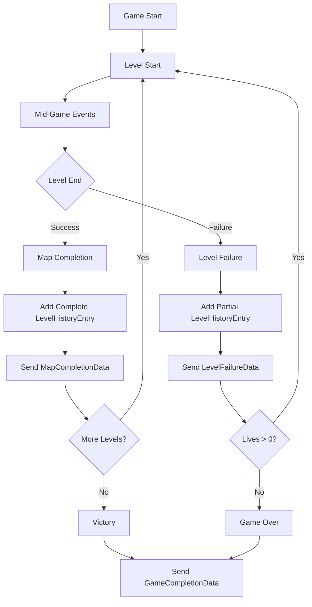

# Level History Mid-Game Logic Implementation

## Overview

This document explains the comprehensive implementation of mid-game logic tracking in the `LevelHistoryEntry` objects within the Sigurd Startup Game. The system captures detailed gameplay statistics during each level and includes them in the level history when maps are completed, providing rich data for analysis and reporting.

## Architecture Overview

### Key Data Structures

#### 1. LevelHistoryEntry Interface (`communicationUtils.ts`)
```typescript
export interface LevelHistoryEntry {
  level: number;
  mapName: string;
  score: number;
  bonus: number;
  completionTime?: number;          // Time taken to complete in milliseconds
  coinsCollected: number;            // Total coins collected during the level
  powerModeActivations: number;      // Number of P-coin activations
  timestamp: number;
  correctOrderCount: number;
  totalBombs: number;
  lives: number;
  multiplier: number;
  isPartial?: boolean;              // True for failed/incomplete levels
}
```

### Data Flow Architecture



## Implementation Details

### 1. Mid-Game Statistics Tracking

The game tracks several key statistics during gameplay that are later included in the level history:

#### Coin Collection Tracking (`coinStore.ts`)
```typescript
interface CoinState {
  // Total counters across entire game session
  totalCoinsCollected: number;
  totalPowerCoinsCollected: number;
  totalBonusMultiplierCoinsCollected: number;
  totalExtraLifeCoinsCollected: number;
  
  // Level-specific counters that accumulate across respawns
  levelCoinsCollected: number;
  levelPowerCoinsCollected: number;
  levelBonusMultiplierCoinsCollected: number;
  levelExtraLifeCoinsCollected: number;
}
```

**Key Features:**
- **Dual Tracking System**: Maintains both total game statistics and level-specific statistics
- **Respawn Persistence**: Level-specific counters persist across player respawns within the same level
- **Real-time Updates**: Statistics are updated immediately when coins are collected

#### Collection Implementation
```typescript
collectCoin: (coin: Coin) => {
  // Update level-specific counters (accumulate across respawns)
  const newLevelCoinsCollected = currentState.levelCoinsCollected + 1;
  const newLevelPowerCoinsCollected = 
    currentState.levelPowerCoinsCollected + (coin.type === "POWER" ? 1 : 0);
  
  // Update total game counters
  const newTotalCoinsCollected = currentState.totalCoinsCollected + 1;
  const newTotalPowerCoinsCollected = 
    currentState.totalPowerCoinsCollected + (coin.type === "POWER" ? 1 : 0);
}
```

### 2. Level Completion Flow

#### Successful Map Completion (`LevelManager.ts`)
When a player successfully completes a level:

```typescript
private proceedAfterMapCleared(): void {
  const completionTime = Date.now() - this.mapStartTime;
  const { levelCoinsCollected, levelPowerCoinsCollected } = useCoinStore.getState();
  
  // Create comprehensive level result
  const levelResult = {
    level: currentLevel,
    mapName: currentMap.name,
    correctOrderCount: correctOrderCount,
    totalBombs: GAME_CONFIG.TOTAL_BOMBS,
    score: score,
    bonus: bonusPoints,
    hasBonus: bonusPoints > 0,
    coinsCollected: levelCoinsCollected,           // Level-specific counter
    powerModeActivations: levelPowerCoinsCollected, // P-coins collected
    completionTime: completionTime,                 // Time from start to completion
    timestamp: Date.now(),
    lives: lives,
    multiplier: multiplier,
    isPartial: false                               // Mark as complete
  };
  
  // Add to level history
  addLevelResult(levelResult);
  
  // Send to host application
  sendMapCompletionData(levelResult);
}
```

**Key Points:**
- Uses **level-specific counters** from the coin store (not total counters)
- Calculates **completion time** from map start
- Marks level as **complete** (not partial)
- Immediately **sends data to host** for external tracking

#### Failed Level/Death (`GameManager.ts`)
When a player loses all lives and the game ends:

```typescript
private handlePlayerDeath(): void {
  if (lives <= 1) {  // Last life - game over
    const { levelCoinsCollected, levelPowerCoinsCollected } = useCoinStore.getState();
    
    // Create partial level result for incomplete level
    const partialLevelResult: LevelHistoryEntry = {
      level: currentLevel,
      mapName: currentMap.name,
      score: score,
      bonus: 0,                                      // No bonus for incomplete levels
      // No completionTime - level wasn't completed
      coinsCollected: levelCoinsCollected,           // Still track what was collected
      powerModeActivations: levelPowerCoinsCollected,
      timestamp: Date.now(),
      correctOrderCount: correctOrderCount,
      totalBombs: bombs.length,
      lives: lives - 1,
      multiplier: multiplier,
      isPartial: true                                // Mark as partial/incomplete
    };
    
    addLevelResult(partialLevelResult);
  }
}
```

**Key Differences for Failed Levels:**
- **No completion time** (level wasn't completed)
- **No bonus points** awarded
- Marked as **`isPartial: true`**
- Still tracks **coins collected** before failure

### 3. Game Completion Data Aggregation

When the game ends (either victory or game over), the system aggregates all level history:

#### Victory Flow (`LevelManager.ts`)
```typescript
public proceedToNextLevel(): void {
  const nextLevelNumber = currentLevel + 1;
  if (nextLevelNumber <= mapDefinitions.length) {
    // Continue to next level
    resetLevelCoinCounters();  // Reset for new level
    nextLevel();
  } else {
    // All levels completed - victory!
    gameStateManager.setState(GameState.VICTORY);
    this.sendGameCompletion("completed");
  }
}
```

#### Game Completion Data Assembly
```typescript
private sendGameCompletion(reason: "completed" | "failed"): void {
  const levelResults = getLevelResults();  // Get all level history entries
  
  // Calculate aggregate statistics from level history
  const gameStats = calculateGameStats(
    levelResults,
    score,
    lives,
    multiplier,
    reason,
    startTime,
    endTime
  );
  
  const gameCompletionData: GameCompletionData = {
    finalScore: score,
    totalLevels: mapDefinitions.length,
    completedLevels: levelResults.filter(l => !l.isPartial).length,
    levelHistory: levelResults,  // Include full history with mid-game stats
    totalCoinsCollected: gameStats.totalCoinsCollected,
    totalPowerModeActivations: gameStats.totalPowerModeActivations,
    totalBombs: gameStats.totalBombs,
    totalCorrectOrders: gameStats.totalCorrectOrders,
    averageCompletionTime: gameStats.averageCompletionTime,
    gameEndReason: reason,
    sessionId: sessionId,
    startTime: startTime,
    endTime: endTime
  };
  
  sendGameCompletionData(gameCompletionData);
}
```

### 4. Statistics Calculation (`communicationUtils.ts`)

The `calculateGameStats` function aggregates data from all level history entries:

```typescript
export const calculateGameStats = (
  levelHistory: LevelHistoryEntry[],
  finalScore: number,
  lives: number,
  multiplier: number,
  gameEndReason: "completed" | "failed",
  startTime: number,
  endTime: number
) => {
  // Aggregate statistics from level history
  const totalCoinsCollected = levelHistory.reduce(
    (sum, level) => sum + level.coinsCollected,
    0
  );
  
  const totalPowerModeActivations = levelHistory.reduce(
    (sum, level) => sum + level.powerModeActivations,
    0
  );
  
  const totalBombs = levelHistory.reduce(
    (sum, level) => sum + level.totalBombs,
    0
  );
  
  const totalCorrectOrders = levelHistory.reduce(
    (sum, level) => sum + level.correctOrderCount,
    0
  );
  
  const totalPlayTime = endTime - startTime;
  const averageCompletionTime = 
    levelHistory.length > 0 ? totalPlayTime / levelHistory.length / 1000 : 0;
  
  return {
    totalCoinsCollected,
    totalPowerModeActivations,
    totalBombs,
    totalCorrectOrders,
    averageCompletionTime: Math.round(averageCompletionTime),
    totalPlayTime: Math.round(totalPlayTime / 1000)
  };
};
```

## Key Design Decisions

### 1. Level-Specific vs Total Counters
- **Level-specific counters** (`levelCoinsCollected`) track statistics for the current level only
- **Total counters** (`totalCoinsCollected`) track statistics for the entire game session
- Level history uses **level-specific counters** to accurately represent per-level performance

### 2. Respawn Handling
- Level-specific counters **persist across respawns** within the same level
- This ensures accurate tracking even when players die and respawn
- Counters only reset when moving to a new level

### 3. Partial Level Tracking
- Failed levels are marked with `isPartial: true`
- Partial levels still track all collected items and statistics
- Completion time is omitted for partial levels (since they weren't completed)

### 4. Real-time Data Communication
The system sends data at multiple points:
1. **Level Start**: `sendLevelStart()` - Creates initial tracking entry
2. **Score Updates**: `sendScoreToHost()` - Real-time score tracking
3. **Map Completion**: `sendMapCompletionData()` - Successful level completion
4. **Level Failure**: `sendLevelFailure()` - Failed level with final stats
5. **Game Completion**: `sendGameCompletionData()` - Final aggregated data

## Usage Example

Here's how the level history data can be used for player analytics:

```javascript
// Example: Analyzing player performance from level history
const analyzePlayerPerformance = (gameData: GameCompletionData) => {
  const levelHistory = gameData.levelHistory;
  
  // Calculate coin collection efficiency
  const coinEfficiency = levelHistory.map(level => ({
    level: level.level,
    mapName: level.mapName,
    coinsPerMinute: level.completionTime 
      ? (level.coinsCollected / (level.completionTime / 60000))
      : 0,
    powerModeUsage: level.powerModeActivations,
    wasCompleted: !level.isPartial
  }));
  
  // Find problematic levels
  const failedLevels = levelHistory.filter(level => level.isPartial);
  
  // Calculate bonus achievement rate
  const bonusAchievementRate = levelHistory
    .filter(level => !level.isPartial)
    .filter(level => level.bonus > 0).length / 
    levelHistory.filter(level => !level.isPartial).length;
  
  return {
    coinEfficiency,
    failedLevels,
    bonusAchievementRate,
    averageCoinsPerLevel: gameData.totalCoinsCollected / levelHistory.length,
    averagePowerModeActivations: gameData.totalPowerModeActivations / levelHistory.length
  };
};
```

## Benefits of This Implementation

### 1. Comprehensive Analytics
- Detailed per-level performance metrics
- Ability to identify player patterns and difficulties
- Rich data for improving game balance

### 2. Accurate Tracking
- Respawn-resilient counting system
- Clear distinction between complete and partial levels
- Precise timing measurements

### 3. Flexible Reporting
- Real-time updates during gameplay
- Batch reporting at game completion
- Support for both success and failure scenarios

### 4. External Integration
- Clean API for host applications
- Standardized data structures
- Event-driven communication pattern

## Conclusion

The mid-game logic tracking in level history provides a robust foundation for understanding player behavior and game performance. By carefully tracking statistics at both the level and game scope, maintaining data across respawns, and clearly distinguishing between complete and partial levels, the system provides rich, actionable data for both real-time feedback and post-game analysis.

The implementation demonstrates thoughtful engineering decisions around data persistence, event timing, and API design, resulting in a comprehensive tracking system that serves both the game's internal needs and external integration requirements.